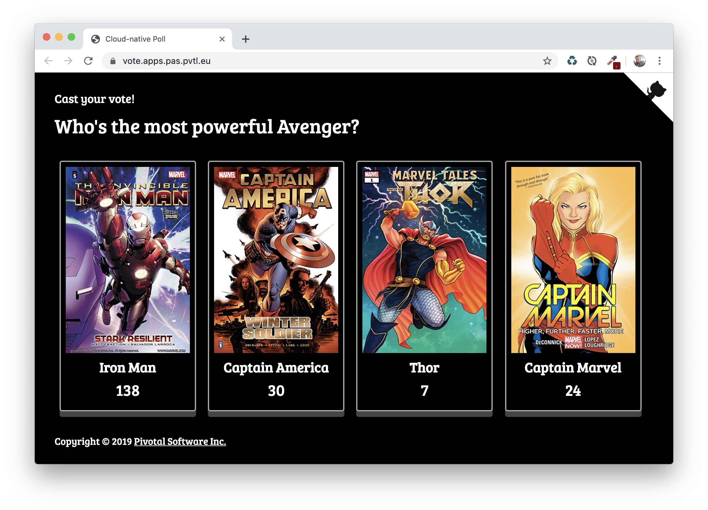

# Cloud-native Poll app for Tanzu Platform for Cloud Foundry

This project is a cloud-native implementation of a voting app, using modern technologies
like [Spring Boot](https://spring.io/projects/spring-boot),
[Spring Cloud](https://spring.io/projects/spring-cloud) and
[Spring Data](https://spring.io/projects/spring-data).

You can freely set up your own questions and thumbnails, by setting configuration
through Spring properties.

The app has been updated to Spring Boot 3.3, and uses Spring Cloud Discovery to find the frontend and backend. The backend is hidden behind `apps.internal` route to prevent unwanted access, only the frontend can call this service.



## Compiling this app

This app is made of 2 microservices: a [backend](backend) and a
[Web UI frontend](frontend). These microservices leverage a RabbitMQ instance to share
messages and a Redis instance to store data.

You need a JDK 17+ to build this both microservices from the parent folder:
```bash
$ ./mvwn clean package
```

### Provision services on Tanzu Platform for Cloud Foundry

Create 3 services:

1. A Redis service called `redis`.
2. A RabbitMQ service called `rabbit`.
3. A Service Discovery service called `discovery`.

### Deploy apps to Tanzu Platform for Cloud Foundry

Review the manifest.yml under `polls-frontend`. the run: 

```
cf push
```

Review the manifest.yml under `polls-backend`, then run:

```
cf push
```

Check your frontend apps's URL in Apps Manager (it will be randomly generated) and open the app.

Check the service discovery dashboard to see both apps registered.

### Preventing access to backend service

In Apps Manager, replace the public route for `polls-backend` with one under the `apps.internal` domain. This will prevent outside access to the backend, since `apps.internal` is only accessible from other apps that have permission.

At first - the communcation will fail. Create a network policy between `polls-frontend` and `polls-backend` on port 8080. Things will now work as expected.

### Add dynamic configuration via Config Server

Create a config server service:

```
cf create-service p.config-server standard config -c '{"git": { "uri": "https://github.com/odedia/cloudnativepoll-config.git", "label": "main" } }'
```

Uncomment:

	    <!--dependency>
	      <groupId>io.pivotal.spring.cloud</groupId>
	      <artifactId>spring-cloud-services-starter-config-client</artifactId>
	    </dependency-->

Add the service `config` to both manifests.

cf push both apps

```
mvn clean package && cd polls-backend && cf push && cd ../polls-frontend && cf push
```


## Contribute

Contributions are always welcome!

Feel free to open issues & send PR.

## License

Copyright &copy; 2021 [VMware, Inc. or its affiliates](https://vmware.com).

This project is licensed under the [Apache Software License version 2.0](https://www.apache.org/licenses/LICENSE-2.0).
