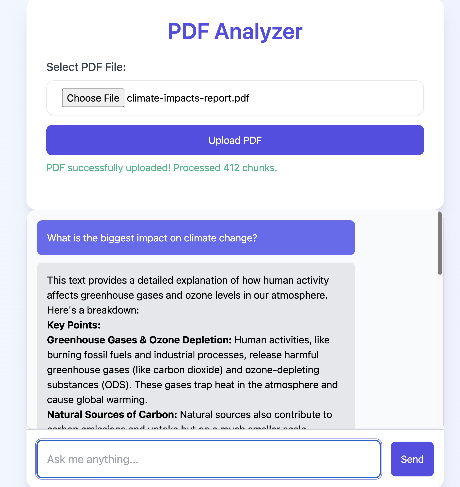

# PDF Analyzer for Tanzu Platform for Cloud Foundry - Powered by Spring AI



This is a simple Spring Boot application that takes an lets you upload a PDF document and ask questions about it using your choise of an embedding model and an LLM.

To begin, create 3 services in the Tanzu Platform for Cloud Foundry marketplace:

- A GenAI service plan that supports embeddings, called `embeddings`.
- A GenAI service plan that supports chat, called `genai-chat`.
- A Postgres service plan called `postgres`.

All that's left to do is:

```
./mvnw clean package && cf push
```

Pull requests are welcomed!

Oded S.
